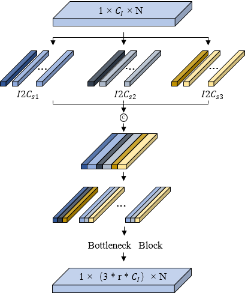
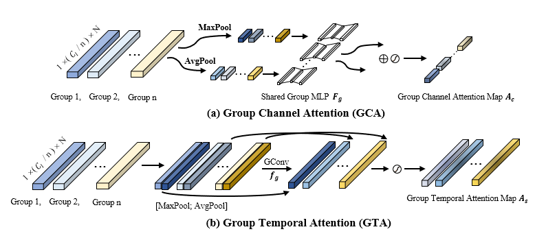
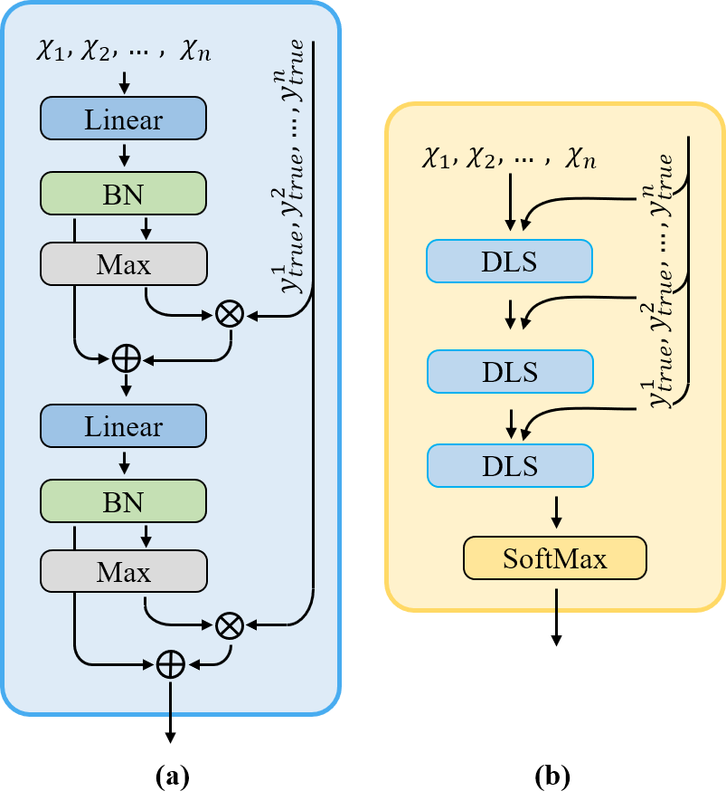

# I2CNet
Code for methods in the paper: Intra- and Inter-Channel Deep Convolutional Neural Network with Dynamic Label Smoothing for Multichannel Biosignal Analysis
## Architecture of I2CNet with dynamic label smoothing

>Detailed architecture of our proposed neural network. The proposed architecture mainly consists of a `feature extractor`, a `label predictor`, and `label adjustor` which not included in a standard feed-forward neural network. During training phase, both label predictor and label adjustor can supervise the feature extractor.
## Different components of I2CNET
1. ***I2C Convolutional Block***

  

>Structure of two kinds of I2C convolution block. (a) First layer convolution block. (b) Non-first layer convolution block.

#### Code implementation ####
* `I2CNet/src/models/model.py`
  * class I2Cv1:  generate a I2C convolution block of type (a).
  * class I2Cv2:  generate a I2C convolution block of type (b).

2. ***I2C MSE Module***

  

>Structure of I2C MSE module.

#### Code implementation ####
* `I2CNet/src/models/model.py`
  * class I2CMSE: generate a I2CMSE Module.

3. ***I2C Attention Module***

  

>Structure of I2C Attention module.

#### Code implementation ####
* `I2CNet/src/models/model.py`
  * class I2CAttention: generate a I2CAttention Module.
 
4. ***DLS Module***

  

>Structure of DLS module.

#### Code implementation ####
* `I2CNet/src/models/model.py`
  * class DLS: generate a DLS Module.

# Requirements

* Python 3.8
* Pytorch 1.11.0
* sklearn 0.24.0

# Usage
You need to use a tensor with shape: **[Batch_size, channel, length]** for all models.
