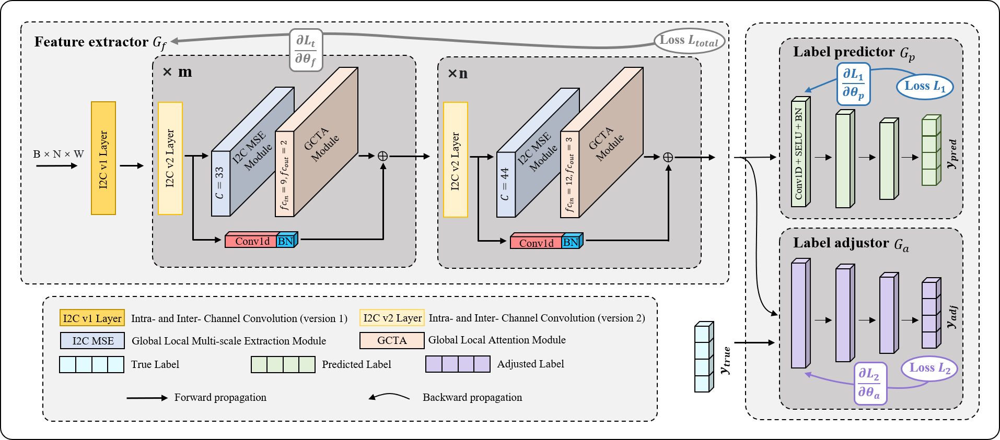

# I2CNet
Code for methods in the paper: Intra- and Inter-Channel Deep Convolutional Neural Network with Dynamic Label Smoothing for Multichannel Biosignal Analysis
## Architecture of I2CNet with dynamic label smoothing

>Detailed architecture of our proposed neural network. The proposed architecture mainly consists of a `feature extractor`, a `label predictor`, and `label adjustor` which not included in a standard feed-forward neural network. During training phase, both label predictor and label adjustor can supervise the feature extractor.
## Different components of I2CNET
### (1). I2C Convolutional Block

  

>Structure of two kinds of I2C convolution block. (a) First layer convolution block. (b) Non-first layer convolution block.

### Code implementation
* `a-layered-sensor-unit/main_experiment/model/ml/`
  * train machine learning model (XGBoost, SVM, RandomForest, KNN).
* `a-layered-sensor-unit/main_experiment/model/dl/model.py`
  * Generate sEMG-FMG LFN model, sEMG LFN model and FMG LFN model.

### I2C MSE Module
### I2C Attention Module
